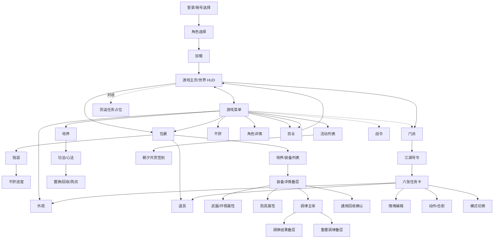
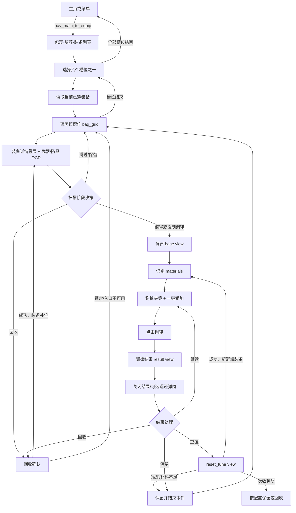

# 游戏机制：UI 页面及关联关系说明

> 本文根据当前仓库的 `scene`、`layout`、`.wf` 和自动调律代码反向还原
> 《燕云十六声》的 UI 信息架构。它描述的是**律匠当前能够看见和操作的游戏
> UI 子集**，不是游戏全部页面的官方清单。
>
> 分析基线：2026-09-01 当前代码与系统配置。

## 1. 结论摘要

从 AI 自动化的角度，当前游戏 UI 最适合被理解为一个分层状态图，而不是一棵
严格的页面树：

1. **主页是运行中枢**：玩家进入世界后停在 `game_main_page`，可直接使用常用
   功能，也可打开 `game_menu_page` 进入绝大多数系统。
2. **菜单是功能目录**：包裹、培养、活动、外观、不肝、百业、角色、门派、战令
   等入口集中于菜单，但部分入口在第二屏，需要滚动或文本查找。
3. **很多 Scene 不是完整页面**：装备详情、通用确认、聊天区、动作面板是覆盖在
   当前页面上的叠层或共享局部区域；`jianghu_card` 更是可复用组件。
4. **一个 Scene 可以包含多个 UI 状态**：例如调律的基础页、结果弹窗、重置页，
   都属于 `equip_tune_detail` 的不同 view。view 只是编辑和理解分组，运行时仍以
   同一 scene key 寻址。
5. **Scene、Layout、Workflow 各回答一个问题**：Scene 说明“画面上有什么”，
   Layout 说明“在这个平台上位于哪里、用点击还是按键”，Workflow/代码状态机
   说明“从哪里来、如何确认到达、下一步去哪里”。
6. **自动调律是混合流程**：公共页面跳转由 `.wf` 提供，背包遍历、装备决策、
   调律轮次、重置和回收由 Python 状态机编排。只看 `.wf` 会漏掉这个最重要的
   游戏 UI 链路。

## 2. 分析依据与可信度

### 2.1 四类证据

| 证据 | 当前来源 | 可以证明什么 | 不能单独证明什么 |
|------|----------|--------------|------------------|
| Scene 注册表 | `config/system/scenes.yaml` | 律匠管理哪些语义场景、如何分组 | 页面一定可达 |
| Scene 定义 | `config/system/scenes/*.yaml` | 页面、视图、按钮、文字区、网格和组件 | 实际坐标和跳转方向 |
| Layout | `config/system/layouts/` | Android/桌面的区域坐标、网格、快捷键 | 页面何时出现 |
| Workflow/代码 | `config/system/workflows/`、`AutoTuningWorkflow` | 已执行过的入口、校验、返回和异常分支 | 尚未编排页面的完整游戏规则 |

本文使用三级可信度：

- **已连通**：Scene 和 Layout 均存在，且 `.wf` 或代码明确执行并校验过。
- **已建模**：Scene 和两端 Layout 存在，但当前流程只使用部分区域，或没有活跃流程。
- **占位/待验证**：只有定义、归档流程或未完成流程，不能据此断言功能可稳定自动化。

### 2.2 数量与覆盖

- 注册表共有 6 个配置分组、29 个 Scene 定义。
- 默认布局和桌面布局各绑定 28 个 Scene。
- `jianghu_card` 作为子场景被 `activity_jianghu` 的 6 个实例复用。
- `huoyun_card` 已注册且有定义，但当前没有布局绑定，是明确的占位缺口。
- `继承布局` 不重复保存场景文件，而是继承 Android 的 `默认布局`，只调整全局
  画布裁剪；桌面布局为 1920×1080，并有独立的逐场景坐标和按键绑定。

## 3. AI 应采用的 UI 心智模型

### 3.1 Scene 不是截图，而是语义命名空间

Scene 中的实体分为：

| 类型 | AI 语义 | 例子 |
|------|---------|------|
| `attr` region | 只读观察量，通常做 OCR | 装备等级、词条、用户名 |
| `func` region/point | 按钮或动作入口，可兼具 OCR 校验 | 返回、调律、一键添加 |
| `slot` region | 可点击的槽位 | 主武器、胸甲、背包格 |
| grid panel | 可滚动、可按行列寻址的重复内容 | 装备背包、钱袋、调律材料 |
| subscene ref | 同一局部结构的多个实例 | 六张江湖号令任务卡 |

因此 `[equip_tune_detail].[tune_btn]` 的本质不是一组固定像素，而是“调律页面
上的调律动作”这一语义目标。物理位置由当前 Layout 决定。

### 3.2 View 是同一页面的可见状态，不是运行时地址

当前重要的多视图场景包括：

| Scene | View | 游戏 UI 含义 |
|-------|------|--------------|
| `game_login_page` | `base/users/roles/loading/start/exit` | 登录基底、账号列表、角色列表、加载、启动及退出状态 |
| `game_main_page` | `base/jiugongge/more` | 世界 HUD、方向/九宫格识别、更多功能 |
| `game_menu_page` | `base/page_1/page_2/mode` | 菜单公共区、上下两屏、游戏模式选择 |
| `bag_equip_detail` | `base/kuaijie` | 装备列表及快捷处理状态 |
| `bag_item_detail` | `base/detail/yangcheng/huodong` | 道具列表、详情与分类 |
| `equip_tune_detail` | `base/result/reset_tune/reset_confirm` | 调律主体、结果、重置检查和确认 |
| `activity_jianghu` | `base/qingjing` | 号令任务列表及情境任务状态 |

重置确认是调律页内的视图，不能因为名称像独立页面就按另一个
Scene 寻址。Workflow 始终使用 `[equip_tune_detail].[...]`。

### 3.3 页面识别是多证据判定

当前公共检测逻辑体现了几个重要原则：

- 主页同时找“菜单/活动/武林录/限时”，还要排除背包页，避免共享 HUD 误判。
- 菜单页用“包裹/培养”确认。
- 背包页用“制造/整理/培养/道具/任务/钱袋”确认。
- 角色选择不能用常驻标题，而要用只在角色视图出现的“进入游戏”。
- 江湖号令同时识别页面标题和“当周获取号令”，降低单区域 OCR 失败概率。

这说明 Scene 的存在不等于页面检测器。可靠的 AI 导航应使用稳定、互斥、最好
多区域的文字或图像证据，并在点击后再次确认目标状态。

## 4. 全局页面关系图

下图只画当前配置和流程能够支持的主干。虚线表示已建模但尚未形成完整稳定流程。



图中的“武器/环佩属性”和“防具属性”是装备详情叠层里的 OCR 语义切面，并非玩家
需要再点击进入的两个独立页面。

## 5. 页面目录与关系

### 5.1 通用与登录域

| Scene | 角色 | 主要状态/区域 | 关系与现状 |
|-------|------|---------------|------------|
| `game_login_page` | 登录、账号、角色选择 | 用户列表、角色列表、切换账号/角色、进入游戏、加载、退出确认 | 批量准备流程已连通账号切换、角色选择、加载和进入主页 |
| `game_main_page` | 世界内主页与 HUD | 菜单、活动、地图、组队、动作、聊天、移动方向、更多、限时 | 所有跨系统流程的共同起终点；桌面可用 ESC/M/U/F2/ENTER 等 |
| `game_menu_page` | 功能总目录 | 两页功能入口、身份信息、模式选择、返回 | 包裹、培养、活动、不肝、百业、角色等流程入口；第二页需滚动 |
| `general_control` | 全局共享控件/叠层 | 确认、取消、关闭物品、空白区、战斗控制、菜单滚动 | 不是单一页面；被登录、购买、回收、重置、任务等流程复用 |
| `general_action` | 动作与拍照叠层 | 动作网格、相机、表情、看报、四个选择位 | 江湖号令的合影/动作任务已使用 |
| `general_chat` | 聊天局部区 | 聊天输入/对话区域 | 百业货运 WIP 使用，不应视作完整页面 |

关键关系：

- Android：主页点“菜单”；桌面：同一语义动作绑定 ESC。
- 桌面从主页或菜单按 B 可直接进入包裹，Android 则走“主页 → 菜单 → 包裹”。
- 菜单滚动不是页面跳转，而是 `page_1 ↔ page_2` 的内容位移。
- 通用确认必须先 OCR 到“确认/确定”再执行；桌面布局把动作绑定为空格。

### 5.2 包裹与物资域

| Scene | 游戏 UI 含义 | 核心结构 | 上下游关系 |
|-------|---------------|----------|------------|
| `bag_detail` | 包裹公共框架 | 培养/道具/任务/钱袋 tab，制造、整理、返回 | 从主页/菜单进入；作为所有包裹子页的公共检测和返回层 |
| `bag_equip_detail` | 培养下的装备列表 | 8 个装备槽、`bag_grid`、装备/快捷 tab、回收 | 装备扫描和自动调律的核心列表页 |
| `bag_item_detail` | 道具列表 | 普通/养成/活动分类、详情、功能按钮、`bag_grid` | 江湖号令“醉意”等任务会导航到普通道具 |
| `bag_wallet_detail` | 钱袋 | `money_1` 区域货币、`money_2` 其他货币、不肝进度入口 | 钱袋扫描会读取并写入玩家档案；Android 还需滚动补扫 |
| `bugan_detail` | 不肝进度与商店 | 进度、分类列表、两个商品网格、全部添加、购买 | 可从菜单进入，也可由钱袋“么玉”入口进入 |
| `zhanling_detail` | 战令奖励 | 一键领取、返回 | 批量角色准备流程使用 |

包裹 tab 的公共判定值为：培养=1、道具=2、任务=3、钱袋=4。识别 tab 失败时，
流程会再读“整理”确认至少已到包裹，而不是直接在未知页面点击。

装备列表的 8 个槽位为：主武器、副武器、环、佩、冠胄、胸甲、胫甲、腕甲。
它们承担两个角色：

1. 点击槽位切换右侧/下方背包装备分组；
2. 读取当前已穿装备，为武器类型分组和扫描边界提供上下文。

`bag_grid` 是滚动内容，不是固定装备集合。回收后后续装备会前移补位，因此自动
调律必须在同一格重读，而不能简单把游标移到下一列。

### 5.3 装备详情与调律域

| Scene | 性质 | 主要内容 | 关系 |
|-------|------|----------|------|
| `equip_detail` | 通用装备详情交互叠层 | 主功能、更多、4 个次功能、桌面功能区 | 从装备格点击后出现；提供调律和回收入口 |
| `equip_weapon_detail` | 武器类数据切面 | 名称/类型、等级、基础属性、五音词条、定音、造诣、状态 | 武器、环、佩使用这组 OCR 字段 |
| `equip_armor_detail` | 防具类数据切面 | 名称/类型、等级、双基础属性、五音词条、定音、造诣、状态 | 冠胄、胸甲、胫甲、腕甲使用 |
| `equip_tune_detail` | 调律页面及其叠层状态 | 5 个词条、一键添加、材料网格、调律、结果、重置、冷却和材料信息 | 从装备详情进入，完成后回到装备详情/装备列表 |

三个 `equip_*_detail` 同时存在，是对同一块游戏详情 UI 的职责拆分：
`equip_detail` 负责可操作按钮，weapon/armor 负责结构不同的装备数据。它们不是
“装备主页 → 武器页 → 防具页”的导航链。

### 5.4 培养、角色与心法域

| Scene | 游戏 UI 含义 | 核心状态 | 关系与自动化证据 |
|-------|---------------|----------|------------------|
| `training_main` | 培养系统 | 角色、功法、装备、天赋 | 心法购买路径经“培养 → 功法”进入 |
| `training_xinfa` | 心法管理 | 5 个散本位、置换、回收、全部添加、最大数量、购买确认 | 自动购买心法已连通完整循环 |
| `role_detail` | 角色属性详情 | 属性、体质、鸣玉、左右详情及返回 | 基础属性扫描会滚动左栏，按关键词展开右栏 |

心法购买的已验证路径是：主页 → 菜单 → 培养 → 功法 → 心法 → 置换；每轮先找
“自选”散本，回收已有心法，再全部添加并购买。确认框没有出现通常被解释为书票
不足，流程随即返回。

角色详情入口可能位于菜单第二屏，因此导航采用“文本查找 → 滚动一页 → 再查找 →
人工介入”的方式，而不是假设固定坐标永远可见。

### 5.5 活动、门派、外观与社交域

| Scene | 游戏 UI 含义 | 核心状态 | 关系与现状 |
|-------|---------------|----------|------------|
| `activity_main` | 活动列表 | 列表、朝夕共赏、签到、返回 | 每日签到已连通朝夕共赏 |
| `activity_jianghu` | 江湖号令 | 标题、当周声望、6 张任务卡、进入/展开/返回、情境入口 | 每日江湖号令完整使用 |
| `jianghu_card` | 单张号令任务卡组件 | 任务文本、刷新按钮 | 在父场景实例化为 `card_1`～`card_6` |
| `activity_huoyun` | 货运活动页 | 返回和主体区域 | 已建模，当前活跃流程未使用 |
| `huoyun_card` | 货运卡片占位 | 暂无有效布局 | 不可据此实现稳定自动化 |
| `activity_mengzhu` | 盟主争锋活动 | 新开、确认、物品点位、下一步 | 仅归档脚本使用，属于待验证旧流程 |
| `school_main` | 门派页 | 门规、地位、号令、商店、玩法、问津、返回 | 江湖号令进入和返回链的一部分 |
| `waiguan_yigui` | 衣柜/穿搭 | 穿搭、方案、套用、返回 | 号令换装任务使用 |
| `waiguan_qingjing` | 情境编辑 | 进入编辑、情境、保存、返回 | 号令情境任务使用 |
| `baiye_main` | 百业 | 返回驻地、百业菜单、活动视图 | 周常货运流程仍标记 WIP |

江湖号令不是简单的“刷新六次”。其当前状态机为：

1. 确认位于号令页；若从主页启动则自动导航，若上一任务留下未知页面则暂停要求
   人工回到号令页。
2. 对 6 张卡分别 OCR 任务文本；不命中目标任务就点卡片自身的刷新按钮，直到
   命中或达到上限。
3. 按文本分派换装、合影、情境、东方、醉意、觉障林等动作，这些动作会跨到
   外观、动作、道具或模式页面。
4. 动作结束必须恢复号令页，再检查任务是否完成；领奖后还要点击空白区域关闭
   全屏奖励层。
5. 当周声望在每次有效识别后同步到玩家档案，达到用户上限后不再领奖。

这里的子场景设计非常关键：`card_1.label` 与 `card_6.label` 语义相同，仅父页面
中的实例位置不同。AI 应把它理解为“列表项模板”，而不是六种任务页面。

## 6. 自动调律与游戏 UI 的完整关联

### 6.1 它为何不只是一条 Workflow

`auto_tuning` 注册为专用的类工作流。界面层“调律管理/调律进度/历史详情”是律匠
自身 UI，只负责配置、启动、观察和回放结果；它不是游戏 Scene，也不应写入游戏
页面图。真正操作游戏的实现分为：

| 层 | 职责 |
|----|------|
| `navigation.wf` | 主页 ↔ 包裹装备页、装备详情 → 调律页 |
| `page_detection.wf` | 主页、菜单、背包、角色选择、号令页状态确认 |
| `page_action.wf` | 扫描并执行通用确认 |
| `AutoTuningWorkflow` | 槽位循环、背包遍历、单件装备状态机 |
| `TuningNavigator/RouteStrategy` | 屏蔽 Android 与桌面的入口/退出差异 |
| `TuningExecutor` | 材料识别、狗粮决策、一轮调律、结果和返还弹窗 |
| `TuningResetter` | 重置次数、冷却、传律石、两次确认 |
| `TuningRecycler` | 回收入口、确认、锁定和补位结果 |

### 6.2 页面级主流程



### 6.3 槽位与扫描边界

自动调律支持 8 个槽位：

- 武器数据组：主武器、副武器、环、佩。
- 防具数据组：冠胄、胸甲、胫甲、腕甲。

主副武器的背包内容还按当前已穿武器类型分组。自动化先读取已穿装备的类型，
再判断背包中的武库装备和低等级装备是“同类型继续扫描”还是“已越过当前类型组”。
环、佩和防具没有这一层武器类型边界。

背包装备按等级倒序是当前流程的重要游戏 UI 假设：非分组部位遇到低于门槛的
装备即可结束当前部位；武器则还需结合类型判断。若装备 OCR 无效、品阶为空或
类型上下文无法解析，流程会保守跳过或退化为部位边界，避免在错误对象上调律。

### 6.4 单件装备状态机

一件装备从详情 OCR 后依次经过：

1. **前置拦截**：武库边界、等级门槛、品阶异常、已确认锁定的装备。
2. **已满判断**：已有 5 条词条时不再进入调律页，只做最终评级和扫描处置。
3. **潜力判定**：未满装备计算预期评级，与进入门槛比较。
4. **扫描行为点**：可保留、回收、强制调律，或进入“调满后回收”模式。
5. **进入调律页**：Android 从“更多”中 OCR 找“调律”；桌面先确认功能区存在
   “调律”，再按 F；进入后用 `tune_btn` 的“词库预览”校验页面。
6. **逐轮调律**：识别材料，决定是否加狗粮，一键添加，确认按钮已变为“调律”，
   点击后 OCR 新词条，关闭结果层，再处理可能出现的狗粮返还层。
7. **轮后行为点**：继续、保留、回收或重置。每轮都更新预期评级，满 5 条后才
   计算实际评级。
8. **回到背包**：退出调律状态，必要时执行回收；回收成功后同格重读补位装备。

### 6.5 调律页面内部状态

`equip_tune_detail` 的 UI 实际包含以下状态转换：

```text
base
  ├─ 展开材料区 → materials 网格可操作
  ├─ 一键添加 → tune_btn 从预览/未就绪变为可调律
  ├─ 调律 → result（读取 tune_affix / tune_tip）
  │            └─ 关闭 → base
  │                 └─ 可选狗粮返还提示 → 再关闭 → base
  └─ 重置调律 → reset_tune（冷却与材料信息）
                 ├─ 首次确认 → general_control.confirm（二次确认）
                 │              └─ 提交 → 结果层 → base
                 └─ 取消/检查失败 → base
```

材料网格当前按 1 行 7 列识别。流程不仅读取名称，还依赖持有数量、投入数量和识别
置信度。大律准石不足可配置为跳过本件、询问或结束全部；数量 OCR 失败与材料确实
不存在必须分开处理。添加狗粮后若触发返还，会出现第二个无边框结果层，不关闭就会
遮挡下一轮按钮。

### 6.6 重置不是普通的“继续”

游戏 UI 上，重置发生在同一个详情页和背包格中；业务上，首词条以外内容被清空，
它应被视为一件新的逻辑装备：

- 重置前的装备以“重置”结束；
- 重置后的装备从新初始词条继续产生独立调律事件；
- 游戏内进度仍可表现为一轮连续操作，但历史详情需要保留两段装备事实。

重置分支需要区分四类可见结果：重置完毕、冷却期中、次数耗尽并按规则转回收/保留、
传律石不足。当前 UI 检查顺序是：本轮已重置次数 → 配置上限 → 按钮剩余次数 → 打开
重置页 → “可重置”冷却判断 → “持有 N”材料判断 → 第一次确认 → 通用二次确认。

### 6.7 Android 与桌面差异

| 动作 | Android | 桌面 |
|------|---------|------|
| 主页进包裹 | 主页 → 菜单 → 包裹 | 主页/菜单按 B |
| 装备详情进调律 | 展开“更多”，在 4 个次功能中 OCR 找“调律”并点击 | OCR 功能区确认“调律”，按 F |
| 调律返回 | 点返回，再收起仍展开的“更多” | 点/按返回后，装备详情仍覆盖背包 |
| 关闭装备详情 | 通常随移动端交互自然恢复 | 必须按 ESC 清除覆盖层再继续对齐网格 |
| 回收 | “更多”中 OCR 找“回收” | 直接按 X |
| 确认 | 坐标点击 | 通常为空格 |
| 重置入口 | 点击布局区域 | R |

AI 不能把桌面快捷键硬编码到语义流程里；正确模型是“执行同一 Scene 动作，由 Layout
或 RouteStrategy 决定激活方式”。

## 7. 当前 Workflow 对页面图的验证范围

| 流程 | 已验证的页面链 | 状态 |
|------|----------------|------|
| 自动调律 | 主页 → 包裹装备 → 装备详情 → 调律/结果/重置/回收 → 主页 | 类工作流，核心链路 |
| 扫描备战装备 | 主页 → 包裹装备 → 8 个穿戴槽详情 → 主页 | 活跃 |
| 扫描全部装备 | 主页 → 包裹装备 → 各槽背包网格滚动 → 主页 | 活跃 |
| 扫描钱袋货币 | 主页 → 包裹钱袋 → 不肝进度 → 主页 | 活跃 |
| 自动购买不肝 | 主页 → 菜单 → 不肝商店/分类/商品网格 → 主页 | 活跃 |
| 自动购买心法 | 主页 → 菜单 → 培养 → 功法/心法置换 → 返回 | 活跃 |
| 每日自动签到 | 主页 → 菜单 → 活动列表 → 朝夕共赏 → 菜单 → 主页 | 活跃 |
| 每日江湖号令 | 主页/号令 → 六任务卡 → 多个任务子系统 → 号令 → 主页 | 活跃 |
| 扫描基础属性 | 主页 → 菜单 → 角色详情滚动/展开 | 独立工具流程 |
| 周常百业货运 | 菜单 → 百业 → 驻地主页 → 对话/货运 | WIP、默认隐藏 |
| 盟主争锋 | 活动开始、确认、物品、下一步 | 已归档，待复核 |
| 太极炸鱼/风沙酒肆 | 世界内战斗/录制坐标序列 | 场景特定，不构成通用页面导航证据 |

## 8. 不应从配置中过度推断的内容

1. `scenes.yaml` 中的“通用/培养/物资/社交/活动/组件”是律匠编辑器分组，不等于
   游戏官方菜单层级。
2. Scene 名称带 `detail` 不代表一定全屏跳转；装备详情明显是叠层。
3. 一个区域存在并不表示活跃流程已使用。例如菜单中大量入口已建模，但当前没有
   Workflow 验证其后续页面。
4. `disabled` 只表示在场景管理 UI 中隐藏，不能推断游戏功能关闭；当前注册表没有
   禁用项。
5. Layout 有坐标只证明曾经标定，不证明游戏版本更新后仍准确。页面文字校验仍是
   必要的安全门。
6. `huoyun_card` 没有布局绑定，`activity_huoyun` 也没有活跃完整流程；货运关系只能
   标为占位或 WIP。
7. `_editor_run.wf`、`_recorded.wf` 和 `_testwf` 是编辑/录制/测试产物，不属于稳定
   游戏机制证据。

## 9. 对后续 AI 自动化建模的建议

### 9.1 给 Scene 增加显式页面性质

目前只能从使用方式推断完整页、叠层、共享区域和组件。建议未来增加类似：

```yaml
surface: page | overlay | shared_fragment | component
parent_candidates: [bag_equip_detail]
```

这会避免 AI 把 `general_control` 或 `equip_weapon_detail` 错画成独立导航节点。

### 9.2 把可达关系作为独立配置

Workflow 是当前唯一可靠的边证据，但从命令反推关系成本高，且条件分支不直观。
可逐步沉淀只读的页面关系元数据：

```yaml
from: equip_detail
action: tune
to: equip_tune_detail
environment: [android, desktop]
verify: equip_tune_detail.tune_btn contains 词库预览
```

它不替代 Workflow，只用于静态检查、文档生成和 AI 规划。

### 9.3 为页面状态定义进入/退出不变量

每个关键页至少应声明：

- 进入后必须看到的稳定证据；
- 与相似页面的排他证据；
- 返回后的预期页面；
- 弹窗缺失时能否安全重试；
- 点击是否可能造成不可逆操作。

自动调律中的“先扫描确认再点”“回收后同格重读”“用户中断保留现场”已经体现
这些思想，适合扩展到其他游戏系统。

## 10. 代码与配置索引

- Scene 注册：[scenes.yaml](../../config/system/scenes.yaml)
- Layout 注册：[layouts.yaml](../../config/system/layouts.yaml)
- Scene 定义目录：[scenes/](../../config/system/scenes/)
- Layout 目录：[layouts/](../../config/system/layouts/)
- 公共导航：[navigation.wf](../../config/system/workflows/subcall/navigation.wf)
- 页面检测：[page_detection.wf](../../config/system/workflows/subcall/page_detection.wf)
- 通用确认：[page_action.wf](../../config/system/workflows/subcall/page_action.wf)
- 自动调律编排：[auto_tuning.py](../../src/lvjiang/apps/yysls/workflows/implementations/auto_tuning.py)
- 平台路径策略：[route_strategy.py](../../src/lvjiang/apps/yysls/workflows/implementations/tuning/route_strategy.py)
- 单轮执行：[executor.py](../../src/lvjiang/apps/yysls/workflows/implementations/tuning/executor.py)
- 重置处理：[resetter.py](../../src/lvjiang/apps/yysls/workflows/implementations/tuning/resetter.py)
- 回收处理：[recycler.py](../../src/lvjiang/apps/yysls/workflows/implementations/tuning/recycler.py)
- 自动调律完整需求：[01-auto-tuning.md](../20-requirements/01-auto-tuning.md)
